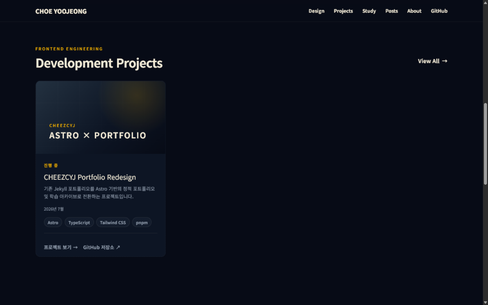
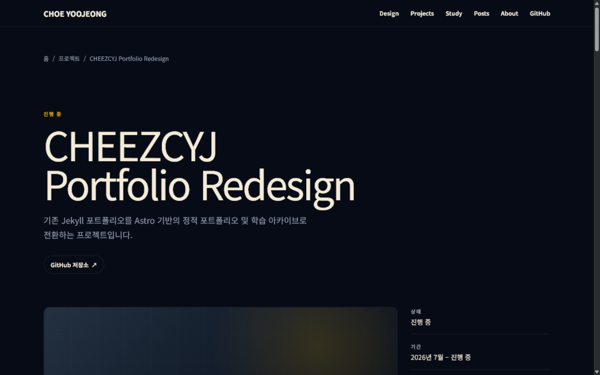
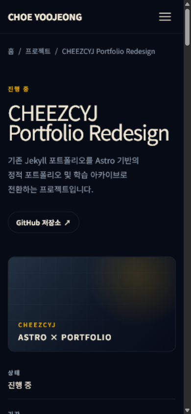
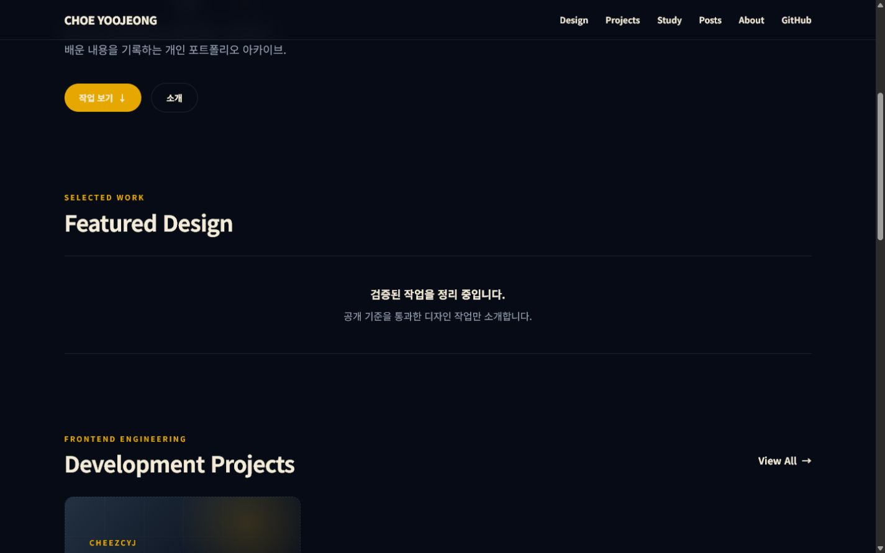
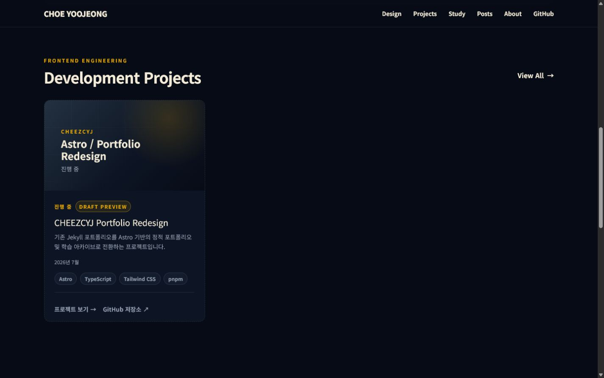
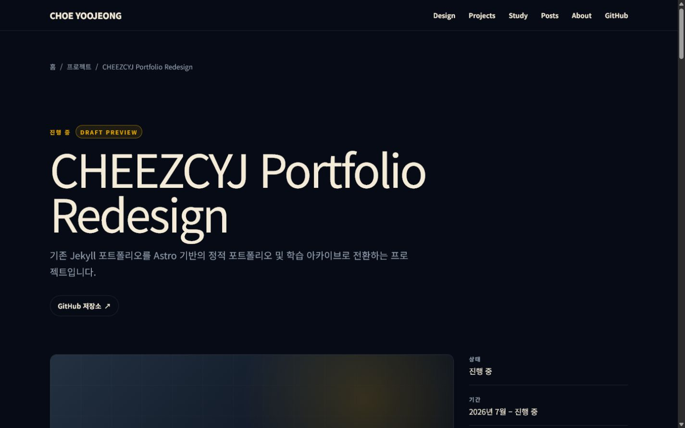
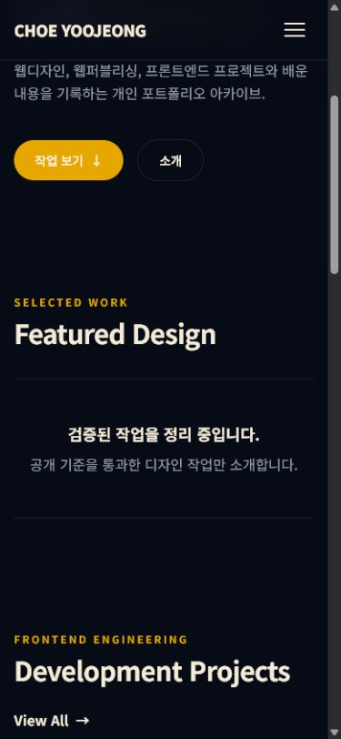
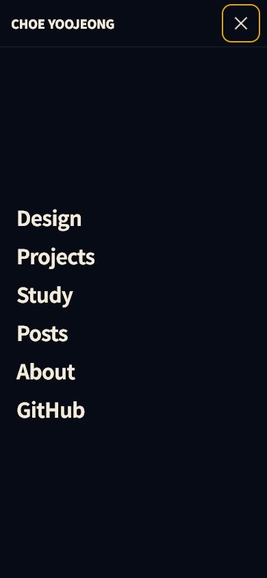
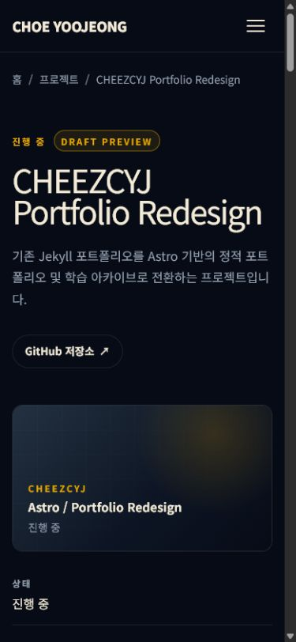

# Phase 4B-3.1 프로젝트 미디어 후보 검토

- 작성일: 2026-07-18
- 대상 브랜치: `redesign/astro-v0`
- 대상 프로젝트: `CHEEZCYJ Portfolio Redesign`
- 현재 승인 기준: `revision-2`

이 문서의 현재 추천은 `docs/media-review/cheezcyj-portfolio-redesign/revision-2/`의 네 PNG를 기준으로 한다. 기존 Phase 4B-3 이미지 여섯 장은 비교 기록으로 그대로 보존하지만 production 후보로 승격하지 않는다. 이번 단계에서도 WebP 변환, `public` 복사, frontmatter 연결, `draft`·`featured` 변경은 수행하지 않았다.

## 1. Revision 2 생성 이유

첫 캡처는 프로젝트의 실제 화면과 반응형 구조를 확인하는 데는 충분했지만 다음 보완이 필요했다.

- 한글 제목·설명·본문에 어절 보존 규칙이 없어 좁은 화면에서 음절 단위 줄바꿈 위험이 있었다.
- media fallback이 프로젝트 전체 제목과 진행 상태를 카드 본문과 중복해 표시했다.
- 기존 상세 후보에는 개발 전용 `Draft Preview`가 포함돼 공개 미디어로 사용할 수 없었다.
- 홈 전체 후보는 비어 있는 Featured Design의 비중이 커 프로젝트 자체를 설명하기 어려웠다.

Revision 2는 카드 rail, 상세 desktop, 모바일 메뉴와 상세 mobile만 다시 캡처해 장면 중복을 줄였다. 기존 레이아웃과 콘텐츠 사실관계는 유지했다.

## 2. 타이포그래피 보정

다음 영역에 언어별 안전 줄바꿈을 적용했다.

| 영역                     | 적용 기준                                                                      |
| ------------------------ | ------------------------------------------------------------------------------ |
| ProjectCard 제목         | `word-break: keep-all`, `overflow-wrap: break-word`, `text-wrap: balance`      |
| ProjectCard 설명         | `word-break: keep-all`, `overflow-wrap: break-word`, `text-wrap: pretty`       |
| 상세 hero 제목           | `keep-all` + `break-word` + `balance`                                          |
| 상세 설명                | `keep-all` + `break-word` + `pretty`                                           |
| breadcrumb               | 한 줄 ellipsis를 유지하면서 `min-width: 0`, `max-width: 100%`, `keep-all` 적용 |
| highlights·Markdown 본문 | 제목은 `balance`, 문장과 목록은 `pretty`, 모두 한글 어절 보존                  |
| 모바일 meta              | `keep-all`, `break-word`, `pretty` 적용                                        |
| 긴 영문 URL·inline code  | 컨테이너 이탈 방지를 위해 `overflow-wrap: anywhere` 적용                       |

320, 390, 768, 1024, 1280, 1440px에서 검사했다. 모든 폭에서 페이지 전체 가로 overflow는 `0`이었고 한글 설명, highlights와 본문에서 `포트 / 폴리오`, `프로 / 젝트`, `입니 / 다` 형태의 음절 단위 분리는 발견되지 않았다. 영문 프로젝트명은 단어 경계에서 자연스럽게 줄바꿈되며 강제 ` `이나 화면별 하드코딩 줄바꿈은 추가하지 않았다.

## 3. ProjectMedia fallback 변경

fallback의 정보 역할을 짧은 브랜드 시그니처로 제한했다.

- 유지: `CHEEZCYJ`
- 유지: `ASTRO × PORTFOLIO`
- 제거: 전체 프로젝트 제목 반복
- 제거: 진행 상태 반복
- 제외 유지: 설명, stack badge, 링크, `Draft Preview`

실제 제목, 상태, 설명, 날짜, stack과 링크는 기존 ProjectCard 본문 순서대로 유지된다. 상세 media에도 같은 두 줄을 사용하되 viewport에 따라 글자 크기만 반응형으로 계산한다. 신규 이미지나 외부 자산은 추가하지 않았다.

## 4. Revision 2 캡처 환경과 목록

- Astro 7 개발 서버: `pnpm dev`
- 브라우저: Codex in-app browser, Developer mode의 full CDP 사용
- 데스크톱: `1440 × 900`, DPR `1`
- 모바일: `390 × 844`, DPR `1`
- Console error: `0`
- 페이지 전체 가로 overflow: `0`
- Astro 개발 툴바, 브라우저 chrome과 개발자 도구 패널: 캡처 제외

| 파일                                       | Route                                    | PNG 픽셀 | 주요 UI                                                |
| ------------------------------------------ | ---------------------------------------- | -------- | ------------------------------------------------------ |
| `revision-2/01-project-rail-desktop.png`   | `/`                                      | 1440×900 | header, Development Projects, View All, 실제 카드 전체 |
| `revision-2/02-project-detail-desktop.png` | `/projects/cheezcyj-portfolio-redesign/` | 1440×900 | breadcrumb, 제목, 설명, 저장소 링크, media와 meta      |
| `revision-2/03-mobile-menu-open.png`       | `/`                                      | 390×844  | header, 닫기 버튼, 전체 메뉴 항목                      |
| `revision-2/04-project-detail-mobile.png`  | `/projects/cheezcyj-portfolio-redesign/` | 390×844  | breadcrumb, 제목, 설명, 저장소 링크, media와 meta      |

### 프로젝트 rail desktop

카드가 하나인 실제 레일을 그대로 보여 준다. 오른쪽 여백을 가짜 카드로 채우지 않았고 media부터 상태, 제목, 설명, 시작일, stack, 상세·GitHub 링크까지 필수 정보를 한 화면에 유지했다.

### 프로젝트 상세 desktop

breadcrumb부터 큰 프로젝트명, 설명, 실제 repository, media와 meta의 시작 부분을 함께 보여 준다. 프로젝트 식별력이 가장 높아 cover 원본으로 추천한다.

### 모바일 메뉴

워드마크, 닫기 버튼과 Design부터 GitHub까지 모든 메뉴가 보인다. body scroll lock과 가로 overflow `0`을 확인했다.

### 프로젝트 상세 mobile

breadcrumb, 두 줄 프로젝트 제목, 한글 설명, repository 링크, 16:9 media와 첫 meta를 1열로 보여 준다. 390px에서 설명이 음절 단위로 분리되지 않는다.

## 5. 기존 이미지와 Revision 2 비교

| 비교 항목   | 기존 Phase 4B-3                                 | Revision 2                                          |
| ----------- | ----------------------------------------------- | --------------------------------------------------- |
| fallback    | 프로젝트명·상태가 카드 본문과 중복              | 짧은 브랜드 시그니처 두 줄만 사용                   |
| 한글 줄바꿈 | 브라우저 기본 동작 의존                         | 제목 `balance`, 문장 `pretty`, 어절 `keep-all` 명시 |
| 상세 캡처   | 개발 전용 `Draft Preview` 포함                  | 캡처 시점에만 badge를 숨겨 공개 후보에 미포함       |
| 홈 후보     | Featured Design 빈 상태 비중이 큼               | 프로젝트 rail에 집중                                |
| 해상도      | 페이지 면적이 scrollbar에 따라 축소된 파일 포함 | 지정 viewport와 같은 1440×900, 390×844 PNG          |

기존 PNG 여섯 장은 삭제하거나 덮어쓰지 않았다. Revision 2는 별도 하위 디렉터리에 저장했다.

## 6. 최종 추천

### Cover

`revision-2/02-project-detail-desktop.png`

큰 프로젝트명과 설명, 실제 repository, media와 meta가 한 장에 있어 작은 카드에서도 프로젝트 성격을 가장 빠르게 전달한다.

### Gallery

1. `revision-2/01-project-rail-desktop.png` — 카드와 수평 rail
2. `revision-2/03-mobile-menu-open.png` — 모바일 내비게이션
3. `revision-2/04-project-detail-mobile.png` — 모바일 상세 1열 구조

cover와 gallery가 각각 상세 desktop, 카드 rail, 메뉴, 상세 mobile을 담당해 같은 장면의 반복을 피한다.

## 7. 제외 이미지

- 기존 `01-home-desktop.png`: 비어 있는 Featured Design과 홈 전반의 비중이 커 프로젝트 후보에서 제외
- 기존 `04-home-mobile.png`: 실제 카드가 viewport 아래에 있어 프로젝트 설명력이 낮아 제외
- 기존 `02`, `03`, `05`, `06`: Revision 2 이전 typography, 중복 fallback 또는 `Draft Preview`를 포함하므로 비교 기록으로만 보존
- Revision 2 상세 desktop의 gallery 중복 사용: cover와 동일한 장면이므로 gallery에서 제외

Featured Design EmptyState 자체는 삭제하거나 재설계하지 않았다.

## 8. Cover 16:9 crop 기준

원본 `1440 × 900`에서 권장 crop은 다음과 같다.

- 좌표: `x=80`, `y=90`, `width=1280`, `height=720`
- 비율: 정확한 `16:9`
- 기준: 전역 header 아래에서 시작해 breadcrumb, 상태, 프로젝트명, 설명, repository 링크, media 상단과 meta 일부를 유지
- 금지: 프로젝트명을 자르는 좌우 crop, 캡처 확대, 비율 왜곡, `Draft Preview` 재노출

전역 header를 cover 맥락에 포함해야 한다면 대안으로 `x=0`, `y=0`, `width=1440`, `height=810`을 사용한다. production 단계에서는 실제 crop 미리보기를 Owner가 다시 확인한다.

## 9. Production 파일명과 한국어 alt 제안

권장 위치는 아직 만들지 않은 `public/images/projects/cheezcyj-portfolio-redesign/`다.

| Revision 2 원본                 | 제안 파일명                  | 한국어 alt                                                                                              |
| ------------------------------- | ---------------------------- | ------------------------------------------------------------------------------------------------------- |
| `02-project-detail-desktop.png` | `cover.webp`                 | 다크 네이비 배경에 CHEEZCYJ Portfolio Redesign 제목, 설명과 프로젝트 미디어를 배치한 데스크톱 상세 화면 |
| `01-project-rail-desktop.png`   | `project-rail-desktop.webp`  | Development Projects 섹션에 Astro 포트폴리오 리디자인 카드 한 개를 배치한 데스크톱 화면                 |
| `03-mobile-menu-open.png`       | `mobile-navigation.webp`     | CHOE YOOJEONG 워드마크 아래 Design부터 GitHub까지 표시한 모바일 전체 화면 메뉴                          |
| `04-project-detail-mobile.png`  | `project-detail-mobile.webp` | 모바일 프로젝트 상세에서 제목과 설명, 저장소 링크, 미디어와 상태 정보를 세로로 표시한 화면              |

이번 단계에서는 위 WebP와 production 디렉터리를 만들지 않았다.

## 10. Draft Preview 제거와 복구 확인

`Draft Preview` 기능과 source UI는 그대로 유지했다. 캡처 직전에 full CDP의 browser runtime에서 `.project-card__preview`와 `.project-preview-badge`에만 임시 `display: none`을 적용했다.

- Astro·CSS·TypeScript 파일을 캡처용으로 변경하지 않음
- 프로젝트 frontmatter의 `draft: true` 유지
- `진행 중` 실제 status는 모든 관련 화면에 유지
- 캡처 네 장에서 `Draft Preview` 미노출 확인
- 상세와 홈을 각각 새로고침한 뒤 badge가 다시 보이고 inline style이 빈 값으로 복구됨을 확인

따라서 캡처용 변경은 저장소나 새로고침 이후 페이지 상태에 남지 않는다.

## 11. 민감 정보 검사

Revision 2 네 장에서 다음 항목이 보이지 않는 것을 확인했다.

- localhost 주소창과 브라우저 탭 UI
- Windows 사용자 이름과 로컬 파일 경로
- 개발자 도구, 터미널과 Astro 개발 툴바
- 이메일, token, 인증 정보와 브라우저 계정 정보
- `Draft Preview`
- 외부에서 임의로 가져온 v0/Jekyll 샘플 이미지

화면의 GitHub 저장소 문구는 Owner가 승인한 공개 repository 링크다.

## 12. Owner 승인 체크리스트

- [ ] `revision-2/02-project-detail-desktop.png`를 cover 원본으로 승인
- [ ] 권장 16:9 crop 좌표 승인
- [ ] gallery 세 장과 순서 승인
- [ ] production 파일명 승인
- [ ] 한국어 alt 승인
- [ ] 이미지 공개 범위와 민감 정보 없음 확인
- [ ] WebP 품질·최적화 방식 승인
- [ ] frontmatter `cover`·`gallery` 연결 승인
- [ ] `draft`와 `featured` 공개 상태 별도 승인

## 13. 승인 이후 범위

Owner 승인 후 별도 단계에서만 16:9 crop, WebP 변환, `public` 복사, frontmatter 연결과 공개 상태 변경을 수행한다. 현재 revision 2 PNG는 계속 `docs/media-review/` 아래의 검토 자산으로만 유지한다.

---

## 부록: Phase 4B-3 Revision 1 기록

아래 내용은 최초 여섯 장의 평가 근거를 보존하기 위한 이전 기록이다. 현재 후보 선정과 production 제안은 위 Revision 2 기준을 우선한다.

### Phase 4B-3 프로젝트 미디어 후보 검토

- 작성일: 2026-07-16
- 대상 브랜치: `redesign/astro-v0`
- 대상 프로젝트: `CHEEZCYJ Portfolio Redesign`
  참고 템플릿: [Graphic Designer Portfolio - v0 by Vercel](https://v0.app/templates/graphic-designer-portfolio-OEGmoMu1hHL)

이 문서는 실제 Astro 개발 화면을 캡처한 검토용 PNG를 평가한다. 이미지들은 `docs/media-review/cheezcyj-portfolio-redesign/`에만 있으며 production 자산이나 프로젝트 frontmatter에는 연결하지 않았다.

## 1. 캡처 환경

- Astro 7 개발 서버: `pnpm dev`
- 캡처 브라우저: Codex in-app browser의 페이지 캡처
- 데스크톱 viewport: `1440 × 900`, DPR `1`
- 모바일 viewport: `390 × 844`, DPR `1`
- 브라우저 주소창, 탭, 운영체제 UI와 개발 도구 패널은 캡처 영역에서 제외했다.
- Astro 개발 툴바는 캡처 중 프로젝트 로컬 preference로만 비활성화했고, 캡처 후 기본값으로 되돌렸다. 저장소 설정 파일은 변경하지 않았다.
- 세 route의 브라우저 console error는 모두 `0`건이었다.
- 데스크톱 PNG는 세로 scrollbar를 제외한 페이지 면적 `1425 × 891`, 일반 모바일 페이지 PNG는 `375 × 812`로 저장됐다. 메뉴가 body scroll을 잠근 `05`는 전체 viewport `390 × 844`로 저장됐다. 검증 기준 viewport와 DPR은 위 값으로 유지됐다.

## 2. 이미지 목록, viewport와 route

| 파일                            | Route                                    | 검증 viewport / DPR | PNG 픽셀 | 주요 UI                                                                    |
| ------------------------------- | ---------------------------------------- | ------------------- | -------- | -------------------------------------------------------------------------- |
| `01-home-desktop.png`           | `/`                                      | 1440×900 / 1        | 1425×891 | sticky header, Hero 하단, Featured Design, Development Projects 진입부     |
| `02-project-rail-desktop.png`   | `/`                                      | 1440×900 / 1        | 1425×891 | 섹션 제목, View All, 단일 ProjectCard, 16:9 fallback, stack과 링크         |
| `03-project-detail-desktop.png` | `/projects/cheezcyj-portfolio-redesign/` | 1440×900 / 1        | 1425×891 | breadcrumb, Draft Preview, 큰 제목, 설명, 저장소 링크, media와 meta 진입부 |
| `04-home-mobile.png`            | `/`                                      | 390×844 / 1         | 375×812  | Hero 설명·CTA, Featured Design, Development Projects 제목                  |
| `05-mobile-menu-open.png`       | `/`                                      | 390×844 / 1         | 390×844  | 워드마크, 닫기 버튼, 전체 화면 메뉴 항목                                   |
| `06-project-detail-mobile.png`  | `/projects/cheezcyj-portfolio-redesign/` | 390×844 / 1         | 375×812  | breadcrumb, Draft Preview, 제목·설명, 저장소 링크, media fallback과 meta   |

## 3. 캡처 후보

### 01. 홈 데스크톱

sticky header 아래 Hero의 설명·CTA, 비어 있는 Featured Design과 Development Projects 진입부가 순서대로 보인다. 홈의 세로 리듬을 설명하지만 프로젝트 자체보다 미등록 디자인 섹션의 빈 상태가 더 크게 보여 대표 이미지에는 약하다.

### 02. 프로젝트 레일 데스크톱

`Development Projects`, `View All`, 실제 단일 draft 카드 전체와 CSS fallback을 한 화면에서 확인할 수 있다. 카드가 하나뿐인 실제 상태를 유지했으며 가짜 카드나 복제는 없다. 오른쪽 빈 공간은 향후 카드가 이어질 영역을 남기지만, 현재는 실제 overflow와 다음 카드 노출이 없다는 사실도 드러낸다.

### 03. 프로젝트 상세 데스크톱

breadcrumb, 진행 상태, Draft Preview, 프로젝트 제목·설명, 실제 저장소 링크, media fallback과 meta 시작 부분이 보인다. 현재 hero 높이에서는 `1440 × 900` 한 viewport 안에 highlights까지 함께 넣을 수 없어서 상단 정보 구조를 우선했다. highlights는 정상 렌더링되지만 이 후보의 화면 아래에 있다.

### 04. 홈 모바일

Hero 설명·CTA에서 Featured Design을 거쳐 Development Projects 제목으로 이어지는 모바일 세로 리듬을 보여 준다. 카드 자체는 viewport 아래에 있으므로 프로젝트 카드 설명력은 `06`보다 낮다.

### 05. 모바일 메뉴 열림

CHOE YOOJEONG 워드마크, 닫기 버튼과 여섯 메뉴 항목이 보인다. `aria-expanded="true"`, body scroll lock, 열린 메뉴의 `aria-hidden="false"`를 함께 확인했다.

### 06. 프로젝트 상세 모바일

breadcrumb, 상태, Draft Preview, 제목·설명, 실제 저장소 링크, 16:9 fallback과 첫 meta를 한 화면에 담는다. 텍스트 잘림이나 페이지 전체 가로 overflow가 없고 프로젝트의 모바일 정보 구조가 가장 명확하다.

## 4. 개인정보와 민감 정보 검사

6개 이미지 모두 다음 항목을 통과했다.

- 로컬 파일 경로와 Windows 사용자 이름 노출 없음
- 브라우저 계정, 주소창, 북마크와 다른 탭 노출 없음
- GitHub token, API key, 터미널과 개발 도구 패널 노출 없음
- 개인 이메일 노출 없음
- Astro 개발 툴바와 디버그 overlay 노출 없음
- 외부에서 임의로 가져온 이미지나 v0/Jekyll 샘플 이미지 없음

화면에 보이는 GitHub 저장소 링크의 목적지는 Owner가 승인한 공개 repository다. Draft Preview 문구는 이 단계가 로컬 검토 후보임을 명확하게 보여 주며, 최종 공개 이미지로 승인할 때 제거 여부를 다시 결정해야 한다.

## 5. v0 템플릿과 유사한 점

- `#070b16` 배경, 크림색 본문과 제한적인 골드 강조
- 최대 1280px 컨테이너와 넉넉한 섹션 간격
- 384px 데스크톱 카드, 16:9 media, 1px 반투명 border와 14px 계열 radius
- muted surface의 stack pill과 작은 eyebrow
- 섹션 제목 오른쪽의 View All 링크
- sticky header와 전체 화면 모바일 메뉴
- 실제 cover가 생기면 약 500ms 동안 `scale(1.05)`를 적용하는 카드 구조
- hover/focus에서 골드 계열을 사용하는 시각 언어

브라우저에서는 레일 키보드 focus의 2px 골드 outline을 확인했다. 현재 fallback은 실제 작품 이미지가 아니므로 hover 확대를 적용하지 않고 안정적으로 유지한다.

## 6. v0 템플릿과 다른 점

- v0 샘플 카드 여러 개 대신 Owner가 검증한 draft 프로젝트 한 개만 표시한다.
- 샘플 작품 이미지 대신 실제 이미지와 구분되는 CSS neutral fallback을 사용한다.
- GitHub root와 `#` 링크를 제거하고 실제 repository만 제공한다.
- 프로젝트 상세를 modal이 아니라 canonical Astro route로 제공한다.
- 카드가 하나라 rail에 실제 overflow, 다음 카드 일부 노출과 데스크톱 이동 버튼이 없다.
- 상세 화면은 v0 홈보다 큰 타이포그래피와 넓은 cinematic 여백을 사용한다.
- Draft Preview 상태가 개발 환경에서 명시적으로 보인다.
- React 전체 hydration 없이 정적 Astro HTML과 작은 Vanilla TypeScript만 사용한다.

공개 템플릿 설명은 Netflix 계열 UI/UX를 언급하지만 현재 화면은 Netflix 로고, 고유한 빨간색, 서비스명, 카드 artwork 또는 고유 표현을 복제하지 않았다. 공통된 요소는 어두운 배경 위의 일반적인 콘텐츠 rail과 cinematic 여백뿐이다.

## 7. Blocking UI 문제

blocking 문제는 발견되지 않았다.

- `/`, `/projects/`, 상세 route 모두 console error `0`
- 세 route 모두 페이지 전체 가로 overflow 없음
- 홈 rail은 `overflow-x: auto`, `touch-action: pan-x pan-y` 유지
- ProjectCard 상세 링크와 repository 링크 접근 가능
- 모바일 메뉴 열기·닫기 구조, body scroll lock과 닫기 버튼 정상
- Markdown 본문과 16개 heading 렌더링 정상
- neutral fallback, title, description과 meta 판독 가능

따라서 이번 단계에서 코드 수정은 하지 않았다.

## 8. 비필수 개선 후보

1. 프로젝트가 한 개라 레일의 다음 카드 affordance가 보이지 않는다. 실제 두 번째 entry가 등록된 뒤 overflow, 이동 버튼과 마지막 disabled 상태를 다시 검수한다.
2. 비어 있는 Featured Design 섹션이 `01`과 `04`에서 시각적 리듬을 크게 차지한다. 디자인 컬렉션 단계에서 실제 콘텐츠가 생긴 뒤 홈 대표 캡처를 다시 만든다.
3. 상세 desktop hero가 길어 breadcrumb부터 highlights까지 한 viewport에 담기지 않는다. 공개 이미지 선정 시 상단과 highlights를 서로 다른 gallery 장면으로 캡처하는 편이 안전하다.
4. 상세 main에는 layout의 프로젝트 제목 `h1`과 Markdown 원문의 `# 프로젝트 개요`가 각각 `h1`으로 존재한다. heading level을 건너뛰지는 않지만 공개 전 콘텐츠 heading 전략을 별도 승인 범위에서 검토할 수 있다.
5. Draft Preview badge는 검토에는 유용하지만 최종 공개 이미지에는 맞지 않을 수 있다. `draft` 해제 후 같은 구도로 다시 캡처한다.

## 9. Cover 후보 추천 순위

1. **`03-project-detail-desktop.png`** — 큰 프로젝트명, Astro 리디자인의 어두운 시각 언어, 실제 상세 정보와 media가 함께 보여 프로젝트 식별력이 가장 높다. 승인 후 16:9 안전 영역으로 crop한다.
2. **`02-project-rail-desktop.png`** — 실제 카드 구조와 stack을 명확하게 보여 주지만 단일 카드와 오른쪽 빈 공간 때문에 대표 이미지 집중도는 1순위보다 낮다.
3. **`06-project-detail-mobile.png`** — 모바일 완성도는 잘 보여 주지만 세로 원본이라 16:9 cover로 전환할 때 여백이나 별도 구성이 필요하다.

현재 PNG는 검토 원본이며 16:9 crop, 확대 또는 WebP 변환을 수행하지 않았다.

## 10. Gallery 후보 추천 순위

cover를 `03`으로 선택한다는 전제에서 중복을 피한 추천 순서다.

1. **`02-project-rail-desktop.png`** — 카드, fallback, stack과 홈 rail 구조
2. **`05-mobile-menu-open.png`** — 모바일 내비게이션과 접근성 인터랙션
3. **`06-project-detail-mobile.png`** — 상세 화면의 모바일 1열 정보 구조
4. **`04-home-mobile.png`** — Hero에서 프로젝트 섹션으로 이어지는 모바일 세로 리듬

## 11. 제외 후보와 이유

- **`01-home-desktop.png`** — 프로젝트보다 비어 있는 Featured Design이 크게 보이고 Hero의 큰 제목은 화면 밖이라 cover와 gallery 모두에서 프로젝트 식별력이 낮다.
- **`03-project-detail-desktop.png`의 gallery 중복 사용** — cover와 같은 원본을 gallery에도 쓰면 장면 중복이 되므로 cover로 승인되면 gallery에서는 제외한다.

## 12. 최종 production 파일명 제안

권장 위치는 아직 생성하지 않은 `public/images/projects/cheezcyj-portfolio-redesign/`다.

| 검토 원본                       | 승인 후 제안 이름             | 용도                                |
| ------------------------------- | ----------------------------- | ----------------------------------- |
| `03-project-detail-desktop.png` | `cover.webp`                  | 16:9 대표 cover crop                |
| `01-home-desktop.png`           | `home-desktop.webp`           | 홈 전체 맥락을 유지할 경우          |
| `02-project-rail-desktop.png`   | `project-rail-desktop.webp`   | 프로젝트 카드와 rail                |
| `03-project-detail-desktop.png` | `project-detail-desktop.webp` | cover로 쓰지 않을 경우 상세 gallery |
| `04-home-mobile.png`            | `home-mobile.webp`            | 모바일 홈                           |
| `05-mobile-menu-open.png`       | `mobile-navigation.webp`      | 모바일 메뉴                         |
| `06-project-detail-mobile.png`  | `project-detail-mobile.webp`  | 모바일 상세                         |

검토 PNG와 최종 WebP는 구분하며, 이번 단계에서는 파일 이동이나 변환을 하지 않았다.

## 13. 추천 alt 문구

- `cover.webp`: 다크 네이비 배경에 CHEEZCYJ Portfolio Redesign 제목과 프로젝트 미디어 패널을 배치한 상세 화면
- `home-desktop.webp`: 포트폴리오 홈에서 Featured Design과 Development Projects 섹션이 이어지는 데스크톱 화면
- `project-rail-desktop.webp`: Development Projects 제목 아래 Draft Preview 프로젝트 카드 한 개를 배치한 데스크톱 수평 레일
- `project-detail-desktop.webp`: 프로젝트 제목과 설명, 저장소 링크, 미디어와 메타 정보를 배치한 데스크톱 상세 화면
- `home-mobile.webp`: 모바일 홈에서 Hero 소개와 Featured Design, Development Projects 섹션이 세로로 이어지는 화면
- `mobile-navigation.webp`: CHOE YOOJEONG 워드마크 아래 Design부터 GitHub까지 표시한 모바일 전체 화면 메뉴
- `project-detail-mobile.webp`: 모바일 프로젝트 상세에서 Draft Preview 제목, 저장소 링크, 미디어 패널과 상태 정보를 표시한 화면

최종 alt는 실제 crop과 Draft Preview 제거 여부가 확정된 뒤 화면에 남은 정보에 맞춰 다시 확인한다.

## 14. Production 미포함 원칙

- 검토 이미지는 `docs/media-review/`에만 유지한다.
- `public`, `src/assets`와 content frontmatter에는 추가하지 않는다.
- Owner 승인 전 WebP 변환과 최적화를 수행하지 않는다.
- production `dist`와 client JavaScript에서 검토 PNG 파일명이나 경로가 발견되면 검증 실패로 처리한다.

## 15. Owner 승인 체크리스트

- [ ] cover 후보 승인
- [ ] gallery 후보 승인
- [ ] 이미지 공개 범위 승인
- [ ] 민감 정보 없음 확인
- [ ] 파일명 승인
- [ ] alt 승인
- [ ] 이미지 최적화 방식 승인
- [ ] 카드 crop 확인
- [ ] 모바일 화면 확인

## 16. 승인 후 다음 단계

Owner 승인 후 별도 단계에서만 다음을 수행한다.

1. 선택된 원본의 16:9 crop과 WebP 최적화
2. 최종 파일을 `public/images/projects/cheezcyj-portfolio-redesign/`로 이동
3. 확정 alt, width와 height를 포함해 `cover`와 `gallery` frontmatter 연결
4. `draft`와 `featured` 공개 상태를 별도 승인
5. production build, Linux CI와 GitHub Pages 공개 검증
